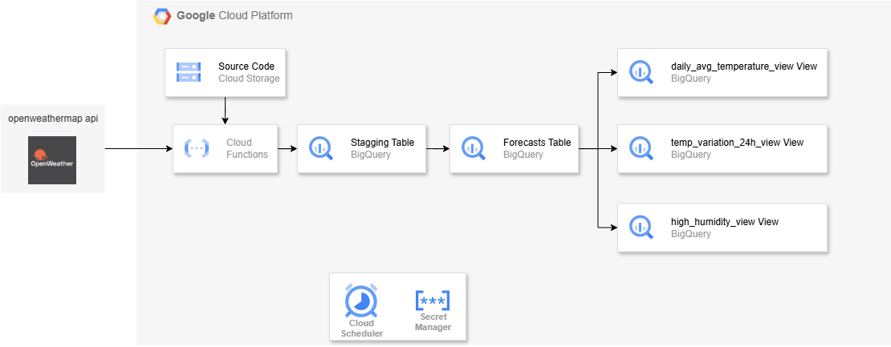

# Projeto de ETL com Google Cloud Platform

Este projeto foi desenvolvido como parte de um desafio técnico proposto pela empresa **Cadastra** para a vaga de **Engenheiro de Dados**. O objetivo é implementar um pipeline ETL (Extract, Transform, Load) utilizando serviços do Google Cloud Platform (GCP) para coletar, transformar e armazenar dados meteorológicos e gerar queries para análises.

## Arquitetura

A arquitetura do projeto é composta pelos seguintes componentes:

1. **Google Cloud Functions**: Executa o código Python para coletar e processar os dados da API OpenWeatherMap.
2. **Google Cloud Scheduler**: Agenda a execução da Cloud Function a cada 3 horas.
3. **Google Secret Manager**: Armazena a chave da API de forma segura.
4. **Google BigQuery**: Armazena os dados processados e fornece views para análises.
5. **Google Cloud Storage**: Armazena o código-fonte da Cloud Function.

## Pré-requisitos

1. **Terraform**: Instale o Terraform para gerenciar a infraestrutura.

   - [Download Terraform](https://developer.hashicorp.com/terraform/downloads)

2. **Google Cloud SDK**: Instale o SDK para autenticação e gerenciamento do GCP.

   - [Download Google Cloud SDK](https://cloud.google.com/sdk/docs/install)

3. **Conta no OpenWeatherMap**: Gere uma API Key gratuita no site do OpenWeatherMap.

   - [OpenWeatherMap](https://openweathermap.org/)

4. **Ativação de Serviços no GCP**: Certifique-se de que os serviços utilizados (Cloud Functions, Cloud Scheduler, BigQuery, Secret Manager, etc.) estão ativados no projeto GCP para evitar erros na execução do Terraform.

## Configuração

1. Clone o repositório:

   ```bash
   git clone https://github.com/JoaoMatheusRG/desafio_cadastra
   ```

2. Configure as variáveis no arquivo `terraform.tfvars`:

   ```plaintext
   project_id  = "<SEU_PROJECT_ID>"
   region      = "<SUA_REGION>"
   ```

3. Execute o script `run.sh` para inicializar e aplicar a infraestrutura:

   ```bash
   ./run.sh
   ```

4. Durante a execução, insira os valores solicitados:
   - `secret_value`: Sua API Key do OpenWeatherMap.
   - `function_service_account_id`: ID da Service Account para a Cloud Function.
   - `scheduler_service_account_id`: ID da Service Account para o Cloud Scheduler.

## Diagrama da Arquitetura



## Extração de Dados

Os dados meteorológicos são extraídos do endpoint `/data/2.5/forecast` da OpenWeatherMap API para as seguintes cidades:

- São Paulo
- Rio de Janeiro
- Salvador
- Curitiba
- Porto Alegre

A API Key é armazenada de forma segura no Google Secret Manager. Em caso de falhas na comunicação com a API, o sistema implementa retry com backoff exponencial e registra logs estruturados para facilitar a depuração.

## Transformação de Dados

Os dados extraídos passam por uma série de transformações para garantir que estejam limpos, estruturados e prontos para análise. Abaixo estão os principais passos realizados durante a transformação:

1. **Conversão de Unidades**:

   - Temperatura: Convertida de Kelvin para Celsius e Fahrenheit utilizando funções específicas (`kelvin_to_celsius` e `kelvin_to_fahrenheit`).
   - Sensação térmica: Convertida de Kelvin para Celsius.

2. **Normalização de Timestamps**:

   - Os timestamps fornecidos pela API em formato Unix são convertidos para o formato `YYYY-MM-DD HH:MM:SS` em UTC.

3. **Extração de Informações Meteorológicas**:

   - Informações como descrição do clima, condição principal e ícone são extraídas do campo aninhado `weather`.

4. **Tratamento de Dados Ausentes**:

   - Registros com valores ausentes em campos críticos, como temperatura, são removidos.

5. **Remoção de Outliers**:

   - Outliers são identificados e removidos com base em um critério de 3 desvios padrão por cidade.

6. **Cálculo de Métricas Derivadas**:

   - **Temperatura Média Diária**: Calculada para cada cidade com base nos registros do dia.
   - **Sensação Térmica Média Diária**: Calculada de forma semelhante à temperatura média.
   - **Tendência de Umidade**: Diferença entre os valores de umidade registrados às 12h e 00h para cada cidade.

7. **Adição de Colunas Auxiliares**:

   - Colunas como data (`forecast_date`), hora (`forecast_hour`) e timestamp de carga (`load_timestamp`) são adicionadas para facilitar análises futuras.

8. **Seleção e Organização de Colunas**:
   - Apenas as colunas relevantes são mantidas no DataFrame final, incluindo informações como temperatura, umidade, velocidade do vento, e métricas derivadas.

Essas transformações garantem que os dados estejam prontos para serem carregados no BigQuery, otimizando a performance e a qualidade das análises.

## Carregamento em BigQuery

Os dados transformados são carregados no BigQuery com as seguintes características:

- **Esquema de Tabela**: O esquema da tabela é definido com base nos campos do DataFrame transformado, incluindo colunas como `city_id`, `forecast_timestamp`, `temperature_celsius`, entre outras. Cada coluna possui um tipo de dado e uma descrição detalhada para facilitar a compreensão e análise.
- **Particionamento e Clusterização**: A tabela final é particionada por dia, utilizando o campo `forecast_timestamp`, e clusterizada por `city_id`. Isso melhora significativamente a performance das consultas e reduz os custos de processamento no BigQuery.
- **Deduplicação e Atualização**: O processo de carregamento utiliza a operação `MERGE` para combinar os dados da tabela staging com a tabela final. Essa abordagem garante que os registros existentes sejam atualizados e novos registros sejam inseridos, evitando duplicatas. A deduplicação é baseada em chaves compostas pelos campos `city_id` e `forecast_timestamp`.
- **Staging Table Temporária**: Antes de realizar o `MERGE`, os dados são carregados em uma tabela staging temporária. Essa etapa permite verificar a integridade dos dados antes de atualizá-los na tabela final.

## Orquestração do Pipeline

O pipeline é orquestrado utilizando os seguintes componentes do GCP:

- **Cloud Functions**: Executa o código Python para processar os dados.
- **Cloud Scheduler**: Agenda a execução da Cloud Function a cada 3 horas.

A escolha por Cloud Functions e Cloud Scheduler foi baseada na simplicidade e no baixo custo para workloads periódicos.

## Consultas SQL

As seguintes consultas SQL foram implementadas no BigQuery para gerar insights:

1. **Tendência de Temperatura Média Diária**: Analisa a variação da temperatura média diária nos últimos 7 dias por cidade.
2. **Variação de Temperatura em 24 Horas**: Identifica as 3 cidades com maior variação de temperatura em um período de 24 horas.
3. **Alta Umidade**: Lista os dias e horários em que a umidade relativa foi superior a 90%.

As consultas utilizam `WITH`, partições e funções de janela para otimizar a performance.

## Assunções

1. O fuso horário utilizado é UTC.
2. O formato da API segue o padrão JSON fornecido pela OpenWeatherMap.
3. Dados ausentes são tratados com imputação por média móvel.

## Escalabilidade para 100+ Cidades

Com base nos testes realizados para 5 cidades, o menor tempo de execução observado foi de **4,37 segundos** e o maior foi de **11,98 segundos**. Abaixo estão as estimativas para diferentes volumes de cidades:

- **100 cidades**:

  - Tempo estimado: 87,4 segundos (mínimo) a 239,6 segundos (máximo).
  - Escolha: **Cloud Functions + Cloud Scheduler**. Essa combinação ainda é viável devido ao tempo de execução estar bem abaixo do limite de 9 minutos por função.

- **200 cidades**:

  - Tempo estimado: 174,8 segundos (mínimo) a 479,2 segundos (máximo).
  - Escolha: **Cloud Run + Cloud Scheduler**. O tempo de execução começa a se aproximar do limite de 9 minutos, e o Cloud Run oferece maior flexibilidade de runtime para lidar com cargas maiores.

- **500 cidades**:
  - Tempo estimado: 437 segundos (mínimo) a 1198 segundos (máximo).
  - Escolha: **Cloud Workflows**. Para volumes tão altos, fluxos mais complexos e paralelismo avançado são necessários, o que torna o Cloud Workflows a melhor opção.

Essas escolhas foram feitas considerando simplicidade, flexibilidade e escalabilidade para diferentes volumes de dados.

## Licença

Este projeto está licenciado sob a [MIT License](LICENSE).
